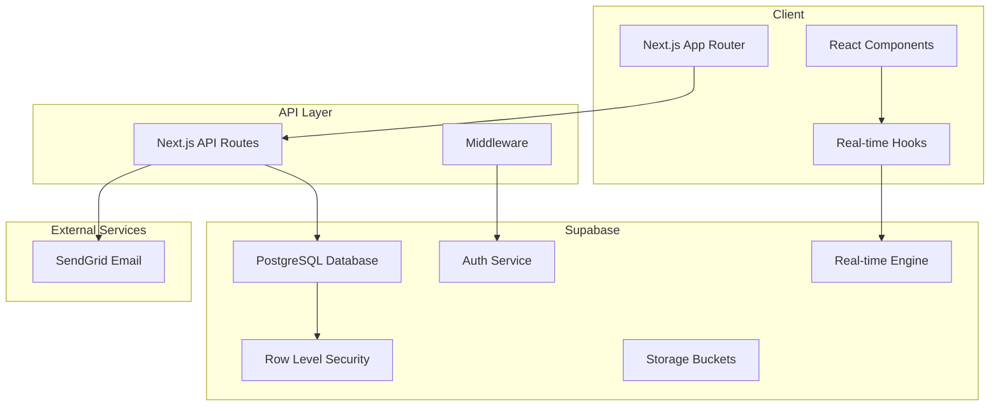
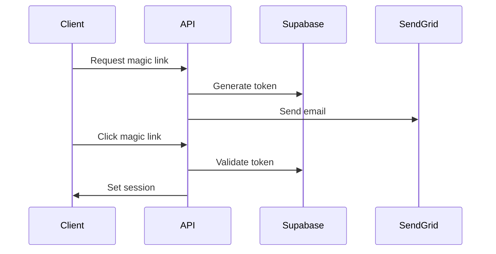

## Overview

The proposal system is built as a monorepo using Nx, with the main application residing in the `apps/aisolutionhub` directory. It uses a modern serverless architecture with Supabase as the backend.

## Architecture Diagram



## Key Design Decisions

### 1. Supabase Over Traditional Backend

**Decision**: Use Supabase instead of building a custom backend

**Rationale**:
- Built-in authentication with magic links
- Real-time subscriptions out of the box
- Row Level Security for fine-grained access control
- Managed PostgreSQL with automatic backups
- Reduced infrastructure complexity

### 2. Custom Magic Links

**Decision**: Implement custom token-based magic links instead of Supabase's built-in magic links

**Rationale**:
- More control over the authentication flow
- Ability to use custom email templates via SendGrid
- Proposal-specific access tokens with custom permissions
- Better analytics tracking

### 3. No External State Management

**Decision**: Use React hooks and Supabase subscriptions instead of Redux/Zustand

**Rationale**:
- Supabase real-time handles state synchronization
- Reduced complexity and bundle size
- Native React patterns are sufficient
- Real-time updates eliminate most state management needs

### 4. Monorepo with Nx

**Decision**: Structure as an Nx monorepo

**Rationale**:
- Better code organization and sharing
- Consistent tooling across projects
- Efficient builds and caching
- Easy to add new applications

## Database Design

### Core Tables

1. **proposals** - Main proposal records
2. **proposal_templates** - Reusable templates
3. **proposal_versions** - Version history
4. **proposal_access** - Access control
5. **proposal_access_tokens** - Magic link tokens
6. **proposal_analytics** - Event tracking
7. **proposal_comments** - Collaboration
8. **proposal_attachments** - File references

### Security Model

All tables use Row Level Security (RLS) policies:

```sql
-- Example: Users can only see proposals they created or have access to
CREATE POLICY "Users can view accessible proposals" ON proposals
  FOR SELECT USING (
    auth.uid() = created_by OR
    EXISTS (
      SELECT 1 FROM proposal_access
      WHERE proposal_id = proposals.id
      AND user_id = auth.uid()
    )
  );
```

## API Design

### RESTful Endpoints

```
GET    /api/proposals          - List proposals
POST   /api/proposals          - Create proposal
GET    /api/proposals/:id      - Get proposal
PUT    /api/proposals/:id      - Update proposal
DELETE /api/proposals/:id      - Delete proposal
POST   /api/proposals/:id/send - Send proposal
```

### Response Format

```typescript
// Success
{
  "data": { ... },
  "meta": {
    "total": 100,
    "page": 1
  }
}

// Error
{
  "error": "Error message",
  "details": { ... }
}
```

## Real-time Architecture

### Subscription Channels

1. **Proposal Channel**: Updates to proposal data
2. **Comments Channel**: New comments and updates
3. **Analytics Channel**: Real-time analytics (admin only)

### Example Implementation

```typescript
const channel = supabase
  .channel(`proposal:${proposalId}`)
  .on('postgres_changes', {
    event: '*',
    schema: 'public',
    table: 'proposals',
    filter: `id=eq.${proposalId}`
  }, handleUpdate)
  .subscribe();
```

## Email Architecture

### SendGrid Integration

- Custom HTML templates for professional emails
- Dynamic template data for personalization
- Fallback to inline HTML if templates not configured
- Rate limiting and error handling

### Email Types

1. **Proposal Invitation** - Magic link for client access
2. **Proposal Viewed** - Notification to sender
3. **Proposal Accepted** - Celebration email
4. **Comment Notification** - New comment alerts

## Deployment Architecture

### Vercel Deployment

```
├── Edge Functions (Middleware)
├── Serverless Functions (API Routes)
├── Static Assets (CDN)
└── ISR Pages (Proposals)
```

### Environment Configuration

- Development: `.env.local`
- Production: Vercel Environment Variables
- Secrets: Supabase service role keys

## Performance Optimizations

1. **Database Indexes** - On foreign keys and search fields
2. **Connection Pooling** - PgBouncer for serverless
3. **Edge Caching** - Static assets on CDN
4. **Lazy Loading** - Components and routes
5. **Real-time Debouncing** - Prevent update storms

## Security Architecture

### Authentication Flow



### Security Measures

- Row Level Security on all tables
- API route authentication middleware
- CSRF protection
- Rate limiting on sensitive endpoints
- Secure token generation
- Environment variable encryption