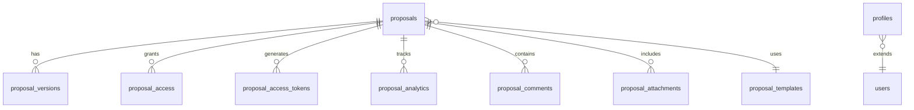

## Schema Overview

The proposal system uses 8 interconnected tables with Row Level Security (RLS) policies for access control.



## Core Tables

### proposals
Main table storing all proposal records.

| Column | Type | Description |
|--------|------|-------------|
| id | UUID | Primary key |
| template_id | UUID | Reference to template |
| client_id | UUID | Optional client user ID |
| client_company | TEXT | Company name (required) |
| client_email | TEXT | Client email (required) |
| client_name | TEXT | Client name (optional) |
| status | ENUM | draft, sent, viewed, accepted, paid, expired |
| customizations | JSONB | Custom content/pricing |
| expires_at | TIMESTAMPTZ | Expiration date |
| created_by | UUID | Creator user ID |
| created_at | TIMESTAMPTZ | Creation timestamp |
| updated_at | TIMESTAMPTZ | Last update timestamp |

### proposal_templates
Reusable templates for proposals.

| Column | Type | Description |
|--------|------|-------------|
| id | UUID | Primary key |
| name | TEXT | Template name |
| description | TEXT | Template description |
| sections | JSONB | Tools, flows, prototypes |
| default_pricing | JSONB | Base pricing structure |
| visual_theme | JSONB | Colors, fonts, etc. |
| is_active | BOOLEAN | Active status |
| created_at | TIMESTAMPTZ | Creation timestamp |
| updated_at | TIMESTAMPTZ | Last update timestamp |

### proposal_access
Access control for proposals.

| Column | Type | Description |
|--------|------|-------------|
| id | UUID | Primary key |
| proposal_id | UUID | Proposal reference |
| user_id | UUID | User with access |
| email | TEXT | Email for non-users |
| role | ENUM | owner, editor, viewer |
| permissions | TEXT[] | Array of permissions |
| granted_by | UUID | Who granted access |
| granted_at | TIMESTAMPTZ | When access granted |
| expires_at | TIMESTAMPTZ | Access expiration |

### proposal_access_tokens
Magic link tokens for authentication.

| Column | Type | Description |
|--------|------|-------------|
| token | TEXT | Primary key (secure token) |
| proposal_id | UUID | Associated proposal |
| email | TEXT | Recipient email |
| permissions | TEXT[] | Granted permissions |
| expires_at | TIMESTAMPTZ | Token expiration |
| used | BOOLEAN | Has been used |
| created_by | UUID | Token creator |
| created_at | TIMESTAMPTZ | Creation time |

## JSONB Structures

### Sections Schema
```json
{
  "tools": [
    {
      "id": "uuid",
      "name": "Tool Name",
      "description": "Tool description",
      "features": ["Feature 1", "Feature 2"]
    }
  ],
  "flows": [
    {
      "id": "uuid",
      "name": "Flow Name",
      "description": "Flow description",
      "steps": ["Step 1", "Step 2", "Step 3"]
    }
  ],
  "prototypes": [
    {
      "id": "uuid",
      "name": "Prototype Name",
      "description": "Prototype description",
      "platform": "iOS/Android/Web"
    }
  ]
}
```

### Pricing Schema
```json
{
  "base": 5000,
  "per_tool": 2500,
  "per_flow": 1500,
  "per_prototype": 3000,
  "monthly_support": 1000,
  "custom_items": [
    {
      "name": "Custom Feature",
      "price": 2000
    }
  ]
}
```

### Theme Schema
```json
{
  "primary_color": "#2563eb",
  "secondary_color": "#7c3aed",
  "font_family": "Inter",
  "logo_position": "top-left",
  "custom_css": ""
}
```

## Indexes

Performance indexes for common queries:

```sql
-- Proposal lookups
CREATE INDEX idx_proposals_created_by ON proposals(created_by);
CREATE INDEX idx_proposals_status ON proposals(status);
CREATE INDEX idx_proposals_client_email ON proposals(client_email);

-- Access control
CREATE INDEX idx_proposal_access_user_id ON proposal_access(user_id);
CREATE INDEX idx_proposal_access_email ON proposal_access(email);

-- Analytics queries
CREATE INDEX idx_proposal_analytics_proposal_id ON proposal_analytics(proposal_id);
CREATE INDEX idx_proposal_analytics_event_type ON proposal_analytics(event_type);

-- Token lookups
CREATE INDEX idx_proposal_access_tokens_email ON proposal_access_tokens(email);
CREATE INDEX idx_proposal_access_tokens_expires_at ON proposal_access_tokens(expires_at);

-- Full text search
CREATE INDEX idx_proposals_search ON proposals 
  USING GIN (to_tsvector('english', client_company || ' ' || COALESCE(client_name, '')));
```

## Row Level Security Policies

### Proposals Table
```sql
-- Users can view proposals they created or have access to
CREATE POLICY "Users can view accessible proposals" ON proposals
  FOR SELECT USING (
    auth.uid() = created_by OR
    EXISTS (
      SELECT 1 FROM proposal_access
      WHERE proposal_id = proposals.id
      AND (user_id = auth.uid() OR email = auth.jwt() ->> 'email')
      AND (expires_at IS NULL OR expires_at > NOW())
    )
  );

-- Only creators can update their proposals
CREATE POLICY "Creators can update proposals" ON proposals
  FOR UPDATE USING (auth.uid() = created_by)
  WITH CHECK (auth.uid() = created_by);
```

### Access Control
```sql
-- Users can view their own access
CREATE POLICY "Users can view own access" ON proposal_access
  FOR SELECT USING (
    user_id = auth.uid() OR 
    email = auth.jwt() ->> 'email' OR
    EXISTS (
      SELECT 1 FROM proposals
      WHERE id = proposal_access.proposal_id
      AND created_by = auth.uid()
    )
  );
```

## Helper Functions

### Check Proposal Access
```sql
CREATE OR REPLACE FUNCTION has_proposal_access(
  p_proposal_id UUID,
  p_user_id UUID DEFAULT NULL,
  p_email TEXT DEFAULT NULL
) RETURNS BOOLEAN AS $$
DECLARE
  v_has_access BOOLEAN;
BEGIN
  SELECT EXISTS (
    SELECT 1 FROM proposals
    WHERE id = p_proposal_id
    AND created_by = COALESCE(p_user_id, auth.uid())
  ) OR EXISTS (
    SELECT 1 FROM proposal_access
    WHERE proposal_id = p_proposal_id
    AND (
      user_id = COALESCE(p_user_id, auth.uid()) OR 
      email = COALESCE(p_email, auth.jwt() ->> 'email')
    )
    AND (expires_at IS NULL OR expires_at > NOW())
  ) INTO v_has_access;
  
  RETURN v_has_access;
END;
$$ LANGUAGE plpgsql SECURITY DEFINER;
```

### Track Analytics Event
```sql
CREATE OR REPLACE FUNCTION track_proposal_event(
  p_proposal_id UUID,
  p_event_type event_type,
  p_event_data JSONB DEFAULT '{}',
  p_anonymous_id TEXT DEFAULT NULL
) RETURNS UUID AS $$
DECLARE
  v_event_id UUID;
BEGIN
  INSERT INTO proposal_analytics (
    proposal_id,
    event_type,
    event_data,
    user_id,
    anonymous_id,
    ip_address,
    user_agent
  ) VALUES (
    p_proposal_id,
    p_event_type,
    p_event_data,
    auth.uid(),
    p_anonymous_id,
    current_setting('request.headers')::json->>'x-forwarded-for',
    current_setting('request.headers')::json->>'user-agent'
  ) RETURNING id INTO v_event_id;
  
  RETURN v_event_id;
END;
$$ LANGUAGE plpgsql SECURITY DEFINER;
```