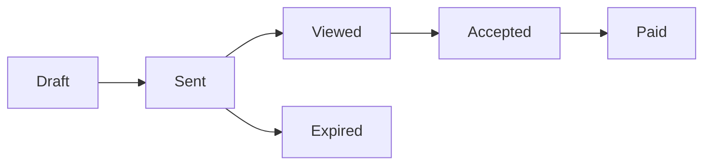

## Proposal Lifecycle

The proposal system manages the complete lifecycle of business proposals from creation to acceptance:



## Core Components

### 1. Proposals
The main entity containing:
- Client information (company, email, name)
- Template reference
- Custom content and pricing
- Status tracking
- Expiration date

### 2. Templates
Reusable proposal structures with:
- Predefined sections (tools, flows, prototypes)
- Default pricing structure
- Visual theme configuration
- Active/inactive status

### 3. Access Control
Fine-grained permissions using:
- Row Level Security (RLS)
- Role-based access (owner, editor, viewer)
- Time-limited magic links
- Token-based authentication

### 4. Real-time Collaboration
Live features including:
- Proposal updates
- Comment threads
- Status changes
- Analytics events

## Magic Link Flow

The system uses custom magic links for secure, passwordless access:

1. **Generation**: Creator sends proposal via API
2. **Token Creation**: Secure token stored in database
3. **Email Delivery**: SendGrid sends professional email
4. **Authentication**: Token validates and grants access
5. **Session**: Temporary or persistent based on user type

## Data Structure

### Proposal Sections
```json
{
  "tools": [
    {
      "id": "1",
      "name": "AI Chat Assistant",
      "description": "24/7 customer support",
      "features": ["NLP", "Multi-language", "Analytics"]
    }
  ],
  "flows": [
    {
      "id": "1",
      "name": "Onboarding Flow",
      "description": "User journey from signup to activation",
      "steps": ["Welcome", "Profile", "Preferences", "Tutorial"]
    }
  ],
  "prototypes": [
    {
      "id": "1",
      "name": "Mobile App Demo",
      "description": "Interactive prototype",
      "platform": "iOS/Android"
    }
  ]
}
```

### Pricing Structure
```json
{
  "base": 5000,
  "per_tool": 2500,
  "per_flow": 1500,
  "per_prototype": 3000,
  "monthly_support": 1000
}
```

## Analytics Tracking

The system tracks all significant events:

| Event Type | Description | Data Captured |
|------------|-------------|---------------|
| `proposal_created` | New proposal created | Creator, template used |
| `proposal_sent` | Emailed to client | Recipient, expiry time |
| `proposal_viewed` | Client opens proposal | Viewer info, timestamp |
| `proposal_accepted` | Client accepts | Acceptance time |
| `comment_added` | New comment posted | Author, content |

## Security Features

### Row Level Security
- Users only see their own proposals
- Clients access via magic links
- Admins have full visibility

### Token Security
- Cryptographically secure generation
- Single-use enforcement
- Time-based expiration
- IP and user agent logging

### API Protection
- Authentication required for all endpoints
- Rate limiting on sensitive operations
- CSRF protection
- Input validation with Zod

## Integration Points

### SendGrid
- Professional HTML emails
- Dynamic template support
- Delivery tracking
- Custom SMTP configuration

### Supabase Services
- Authentication
- Real-time subscriptions
- File storage
- Database with RLS

### Next.js Features
- API Routes
- Server Components
- Middleware protection
- Static optimization