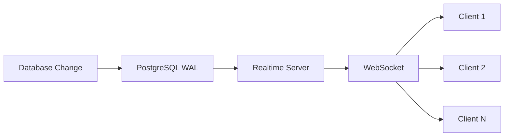

## Overview

The proposal system uses Supabase's real-time engine to provide live updates for:
- Proposal status changes
- New comments
- Viewing activity
- Collaborative editing

## How It Works

Supabase real-time uses PostgreSQL's replication functionality to broadcast database changes to connected clients via WebSockets.



## Enabling Real-time

Tables must be added to the real-time publication:

```sql
-- Enable real-time for proposals
ALTER PUBLICATION supabase_realtime ADD TABLE proposals;

-- Enable real-time for comments
ALTER PUBLICATION supabase_realtime ADD TABLE proposal_comments;
```

## Client Implementation

### Using the useProposal Hook

The `useProposal` hook automatically subscribes to real-time updates:

```typescript
import { useProposal } from '@/hooks/useProposal';

function ProposalPage({ proposalId }: { proposalId: string }) {
  const { proposal, loading, error } = useProposal(proposalId);
  
  // Component automatically re-renders when proposal updates
  return <div>{proposal?.status}</div>;
}
```

### Manual Subscription

For custom real-time needs:

```typescript
import { createClient } from '@/utils/supabase/client';

function setupRealtimeSubscription(proposalId: string) {
  const supabase = createClient();
  
  const channel = supabase
    .channel(`proposal-${proposalId}`)
    .on(
      'postgres_changes',
      {
        event: '*', // INSERT, UPDATE, DELETE
        schema: 'public',
        table: 'proposals',
        filter: `id=eq.${proposalId}`
      },
      (payload) => {
        console.log('Change received!', payload);
        handleProposalChange(payload);
      }
    )
    .subscribe();
    
  // Cleanup
  return () => {
    supabase.removeChannel(channel);
  };
}
```

## Subscription Patterns

### 1. Single Record Updates

Monitor changes to a specific proposal:

```typescript
const channel = supabase
  .channel('proposal-updates')
  .on(
    'postgres_changes',
    {
      event: 'UPDATE',
      schema: 'public',
      table: 'proposals',
      filter: `id=eq.${proposalId}`
    },
    handleUpdate
  )
  .subscribe();
```

### 2. List Updates

Monitor all proposals for a user:

```typescript
const channel = supabase
  .channel('user-proposals')
  .on(
    'postgres_changes',
    {
      event: '*',
      schema: 'public',
      table: 'proposals',
      filter: `created_by=eq.${userId}`
    },
    handleListChange
  )
  .subscribe();
```

### 3. Comment Stream

Real-time comment updates:

```typescript
const channel = supabase
  .channel('proposal-comments')
  .on(
    'postgres_changes',
    {
      event: 'INSERT',
      schema: 'public',
      table: 'proposal_comments',
      filter: `proposal_id=eq.${proposalId}`
    },
    (payload) => {
      // Add new comment to UI
      addComment(payload.new);
    }
  )
  .subscribe();
```

## Presence (Coming Soon)

Track who's viewing a proposal:

```typescript
const channel = supabase.channel(`proposal:${proposalId}`);

// Track presence
channel
  .on('presence', { event: 'sync' }, () => {
    const state = channel.presenceState();
    console.log('Online users:', state);
  })
  .on('presence', { event: 'join' }, ({ key, newPresences }) => {
    console.log('User joined:', newPresences);
  })
  .on('presence', { event: 'leave' }, ({ key, leftPresences }) => {
    console.log('User left:', leftPresences);
  })
  .subscribe(async (status) => {
    if (status === 'SUBSCRIBED') {
      await channel.track({
        user_id: user.id,
        user_email: user.email,
        online_at: new Date().toISOString()
      });
    }
  });
```

## Performance Optimization

### 1. Channel Reuse

Share channels between components:

```typescript
// contexts/realtime-context.tsx
const RealtimeContext = createContext<RealtimeChannel | null>(null);

export function RealtimeProvider({ proposalId, children }) {
  const [channel, setChannel] = useState<RealtimeChannel | null>(null);
  const supabase = createClient();
  
  useEffect(() => {
    const ch = supabase.channel(`proposal:${proposalId}`);
    setChannel(ch);
    
    return () => {
      supabase.removeChannel(ch);
    };
  }, [proposalId]);
  
  return (
    <RealtimeContext.Provider value={channel}>
      {children}
    </RealtimeContext.Provider>
  );
}
```

### 2. Debouncing Updates

Prevent update storms:

```typescript
import { debounce } from 'lodash';

const debouncedUpdate = debounce((payload) => {
  updateProposal(payload.new);
}, 500);

channel.on('postgres_changes', { event: 'UPDATE' }, debouncedUpdate);
```

### 3. Selective Subscriptions

Only subscribe to needed fields:

```typescript
// Coming in future Supabase versions
const channel = supabase
  .channel('minimal-updates')
  .on(
    'postgres_changes',
    {
      event: 'UPDATE',
      schema: 'public',
      table: 'proposals',
      filter: `id=eq.${proposalId}`,
      // Future feature: select specific columns
      columns: ['status', 'updated_at']
    },
    handleUpdate
  )
  .subscribe();
```

## Error Handling

Handle connection issues gracefully:

```typescript
const channel = supabase
  .channel('proposal-updates')
  .on('postgres_changes', config, handleUpdate)
  .subscribe((status, err) => {
    if (status === 'SUBSCRIBED') {
      console.log('Connected to real-time');
    } else if (status === 'CHANNEL_ERROR') {
      console.error('Real-time error:', err);
      // Implement retry logic
      setTimeout(() => {
        channel.subscribe();
      }, 5000);
    } else if (status === 'TIMED_OUT') {
      console.log('Real-time connection timed out');
    } else if (status === 'CLOSED') {
      console.log('Real-time connection closed');
    }
  });
```

## Security Considerations

1. **RLS Applies**: Real-time respects Row Level Security
2. **Filter Client-Side**: Additional filtering may be needed
3. **Validate Updates**: Always validate data from real-time events
4. **Rate Limiting**: Implement client-side throttling

## Testing Real-time

Test real-time in development:

```typescript
// __tests__/realtime.test.ts
import { createClient } from '@supabase/supabase-js';

describe('Real-time subscriptions', () => {
  it('receives proposal updates', async () => {
    const client1 = createClient(URL, ANON_KEY);
    const client2 = createClient(URL, ANON_KEY);
    
    const updates: any[] = [];
    
    // Subscribe with client1
    const channel = client1
      .channel('test')
      .on('postgres_changes', {
        event: 'UPDATE',
        schema: 'public',
        table: 'proposals'
      }, (payload) => {
        updates.push(payload);
      })
      .subscribe();
    
    // Update with client2
    await client2
      .from('proposals')
      .update({ status: 'sent' })
      .eq('id', testProposalId);
    
    // Wait for real-time
    await new Promise(resolve => setTimeout(resolve, 1000));
    
    expect(updates).toHaveLength(1);
    expect(updates[0].new.status).toBe('sent');
  });
});
```