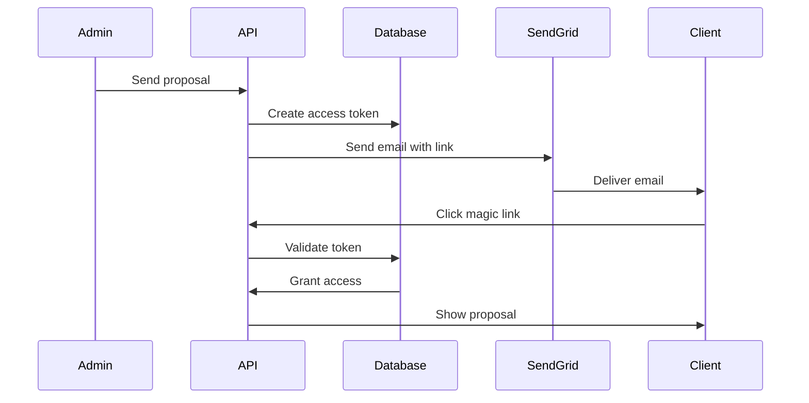

## Overview

The proposal system uses Supabase Auth for user authentication and a custom profiles table for role-based access control. This guide covers setting up authentication for both admin users and client access via magic links.

## Admin Authentication

### 1. Create Admin User

First, create your admin user in the Supabase dashboard:

1. Go to **Authentication** → **Users**
2. Click **Add User** → **Create new user**
3. Enter email and password
4. Click **Create user**

### 2. Grant Admin Access

Run this SQL query to make the user an admin:

```sql
UPDATE profiles 
SET is_admin = true 
WHERE email = 'your-admin@email.com';
```

### 3. Admin Middleware

The system uses middleware to protect admin routes:

```typescript
// middleware.ts
if (request.nextUrl.pathname.startsWith('/admin')) {
  const { data: { user } } = await supabase.auth.getUser();
  
  if (!user) {
    return NextResponse.redirect(new URL('/login', request.url));
  }

  const { data: profile } = await supabase
    .from('profiles')
    .select('is_admin')
    .eq('user_id', user.id)
    .single();

  if (!profile?.is_admin) {
    return NextResponse.redirect(new URL('/unauthorized', request.url));
  }
}
```

## Client Authentication (Magic Links)

### How It Works

1. **No Password Required**: Clients access proposals via secure magic links
2. **Time-Limited**: Links expire after a configurable period
3. **Single Use**: Tokens are marked as used after first access
4. **Granular Permissions**: Each link can have specific permissions

### Magic Link Flow



### Token Security

Tokens are generated using:
```javascript
const token = crypto.randomBytes(32).toString('hex');
```

This provides:
- 256 bits of entropy
- Cryptographically secure randomness
- URL-safe encoding

## Supabase Auth Configuration

### Email Provider Settings

1. Navigate to **Authentication** → **Providers** → **Email**
2. Configure:
   - **Enable Email Provider**: ON
   - **Confirm email**: OFF (development) / ON (production)
   - **Enable email change**: ON
   - **Enable signup**: OFF

### Security Settings

1. Go to **Authentication** → **Security**
2. Configure:
   - **Enable RLS**: Always ON
   - **JWT expiry**: 3600 (1 hour)
   - **Enable refresh token rotation**: ON

### Email Templates

For production, configure custom email templates:

1. Go to **Authentication** → **Email Templates**
2. Customize templates for:
   - Confirm signup
   - Magic link
   - Change email
   - Reset password

## Login Page Implementation

```typescript
// app/login/page.tsx
'use client';

import { createClient } from '@/utils/supabase/client';
import { useState } from 'react';
import { useRouter } from 'next/navigation';

export default function LoginPage() {
  const [email, setEmail] = useState('');
  const [password, setPassword] = useState('');
  const [loading, setLoading] = useState(false);
  const supabase = createClient();
  const router = useRouter();

  const handleLogin = async (e: React.FormEvent) => {
    e.preventDefault();
    setLoading(true);

    const { error } = await supabase.auth.signInWithPassword({
      email,
      password,
    });

    if (error) {
      alert(error.message);
    } else {
      router.push('/admin/proposals');
    }

    setLoading(false);
  };

  return (
    <form onSubmit={handleLogin}>
      {/* Form fields */}
    </form>
  );
}
```

## Session Management

### Server-Side Session Check

```typescript
// utils/auth.ts
import { createClient } from '@/utils/supabase/server';

export async function getSession() {
  const supabase = createClient();
  const { data: { session }, error } = await supabase.auth.getSession();
  
  if (error || !session) {
    return null;
  }
  
  return session;
}

export async function requireAuth() {
  const session = await getSession();
  
  if (!session) {
    redirect('/login');
  }
  
  return session;
}
```

### Client-Side Auth Hook

```typescript
// hooks/use-auth.ts
import { useEffect, useState } from 'react';
import { createClient } from '@/utils/supabase/client';
import type { User } from '@supabase/supabase-js';

export function useAuth() {
  const [user, setUser] = useState<User | null>(null);
  const [loading, setLoading] = useState(true);
  const supabase = createClient();

  useEffect(() => {
    // Get initial session
    supabase.auth.getSession().then(({ data: { session } }) => {
      setUser(session?.user ?? null);
      setLoading(false);
    });

    // Listen for changes
    const { data: { subscription } } = supabase.auth.onAuthStateChange(
      (_event, session) => {
        setUser(session?.user ?? null);
      }
    );

    return () => subscription.unsubscribe();
  }, [supabase]);

  return { user, loading };
}
```

## Troubleshooting

### Common Issues

1. **"Invalid login credentials"**
   - Verify email and password are correct
   - Check if user exists in Authentication → Users
   - Ensure email is confirmed if required

2. **"Unauthorized" after login**
   - Check profiles table has entry for user
   - Verify `is_admin` is set to true
   - Clear browser cookies and try again

3. **Session expires quickly**
   - Check JWT expiry settings
   - Implement refresh token rotation
   - Use `supabase.auth.refreshSession()` when needed

### Debug Queries

```sql
-- Check if user exists in profiles
SELECT * FROM profiles WHERE email = 'your@email.com';

-- Check admin users
SELECT email, is_admin FROM profiles WHERE is_admin = true;

-- View auth audit log
SELECT * FROM auth.audit_log_entries 
WHERE payload->>'email' = 'your@email.com' 
ORDER BY created_at DESC;
```